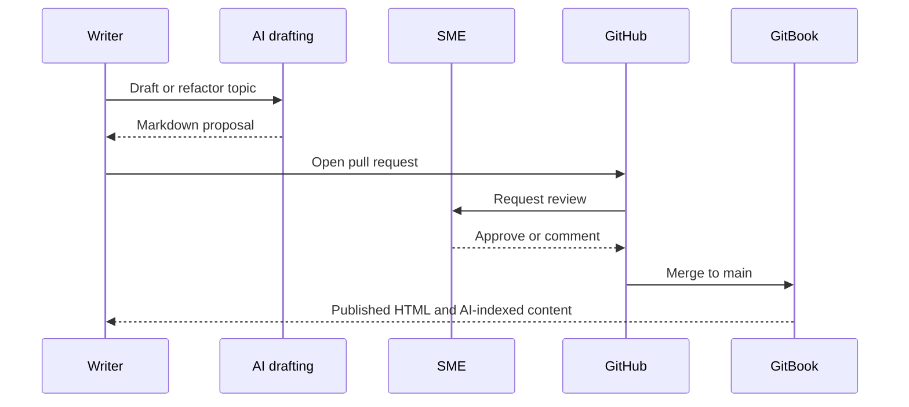

# Authoring & contribution

NI's authoring challenge is not just format conversion. It is access. DITA stored in Oracle makes it hard for AI systems, SMEs, agencies, and customer contributors to participate directly.

<table data-view="cards"><thead><tr><th></th><th></th><th></th><th data-hidden data-card-target data-type="content-ref"></th></tr></thead><tbody>
<tr><td><h3><i class="fa-file-code" style="color:$primary;">:file_code:</i></h3></td><td><strong>DITA to Markdown strategy</strong></td><td>Choose between full Markdown authoring and DITA-to-Markdown as a publishing pipeline.</td><td><a href="dita-to-markdown.md">DITA strategy</a></td></tr>
<tr><td><h3><i class="fa-code-branch" style="color:$primary;">:code_branch:</i></h3></td><td><strong>GitHub contribution workflow</strong></td><td>Give SMEs, agencies, and approved external contributors a governed path to propose changes.</td><td><a href="github-contribution-workflow.md">Contribution workflow</a></td></tr>
<tr><td><h3><i class="fa-users-gear" style="color:$primary;">:users_gear:</i></h3></td><td><strong>Roles and review model</strong></td><td>Map writers, SMEs, localization, and doc services into a clear approval flow.</td><td><a href="roles-and-review.md">Roles</a></td></tr>
</tbody></table>

## Content lifecycle

