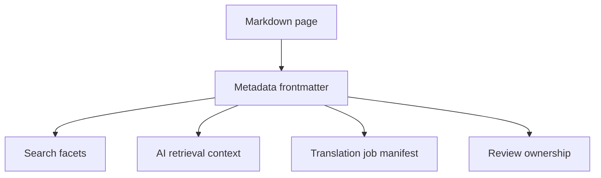

# Metadata and taxonomy

Online HTML delivery should enrich content with metadata that helps search, AI answers, governance, and translation.

| Field | Example | Why it matters |
| --- | --- | --- |
| Product | LabVIEW, TestStand, FlexLogger | Routes content ownership and search facets |
| Content type | Concept, task, reference, release note | Improves navigation and AI retrieval |
| Audience | Developer, test engineer, admin, customer-only | Supports conditional access and personalization |
| Source format | Markdown, DITA export, DITA source | Makes migration state visible |
| Translation state | Source changed, in translation, localized | Keeps localization and publishing aligned |

