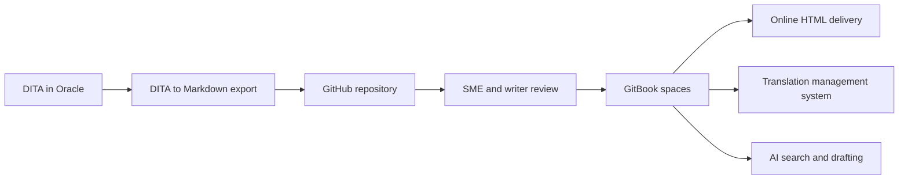

# NI Documentation Transformation Demo

A tailored GitBook sandbox for National Instruments, focused on the software-documentation slice of a larger CMS transformation.

This first draft borrows the product-catalog feel of the SICK demo, then adapts it to NI's actual evaluation themes: moving from DITA in Oracle, replacing Zoomin, opening contribution through GitHub, keeping translation non-negotiable, and giving writers an AI-native workflow.


{% column width="64%" %}
<button type="button" class="button primary" data-action="ask" data-icon="gitbook-assistant">Ask the NI docs transformation demo...</button>

<button type="button" class="button secondary" data-action="ask" data-query="How would GitBook support NI's TMS workflow?" data-icon="language">TMS workflow</button> <button type="button" class="button secondary" data-action="ask" data-query="How can SMEs contribute through GitHub?" data-icon="code-branch">Open contribution</button> <button type="button" class="button secondary" data-action="ask" data-query="What is the path from DITA to Markdown?" data-icon="diagram-project">DITA to Markdown</button> <button type="button" class="button secondary" data-action="ask" data-query="How does GitBook improve authoring velocity?" data-icon="sparkles">AI authoring</button>


{% column width="36%" %}

**This is a discovery-driven sandbox.** It uses a small representative content set to show the future-state operating model, not to migrate NI's full 300,000-page estate.




***

## Choose a transformation path

<table data-view="cards"><thead><tr><th></th><th></th><th></th><th data-hidden data-card-target data-type="content-ref"></th></tr></thead><tbody>
<tr><td><h3><i class="fa-pen-to-square" style="color:$primary;">:pen:</i></h3></td><td><strong>Author and contribute</strong></td><td>How writers, SMEs, agencies, and customers can collaborate through Markdown, pull requests, review workflows, and AI drafting.</td><td><a href="https://app.gitbook.com/s/XSPACE_AUTHORING/">Authoring</a></td></tr>
<tr><td><h3><i class="fa-language" style="color:$primary;">:language:</i></h3></td><td><strong>Deliver and localize</strong></td><td>How GitBook supports online HTML delivery, metadata, gated/public publishing, PDF continuity, and translation handoffs.</td><td><a href="https://app.gitbook.com/s/XSPACE_DELIVERY/">Delivery</a></td></tr>
<tr><td><h3><i class="fa-sparkles" style="color:$primary;">:sparkles:</i></h3></td><td><strong>Automate with AI</strong></td><td>Where AI search, drafting, content checks, MCP access, and metrics reduce authoring friction and increase velocity.</td><td><a href="https://app.gitbook.com/s/XSPACE_AI/">AI</a></td></tr>
</tbody></table>

## Why this matters for NI



### Current-state friction

* DITA content is stored in Oracle and hard to access directly.
* Zoomin is going away, creating a forced delivery-platform decision.
* The team needs public and gated publishing, without losing legacy PDF paths.
* Translation is mandatory and already depends on a mature TMS with APIs.



### Future-state signal

* Git-backed docs give writers, SMEs, and agencies a familiar contribution path.
* Markdown unlocks AI-assisted authoring without blocking a DITA transition path.
* Metadata-rich HTML improves search, AI answers, and customer navigation.
* GitBook can show a practical alternative to a costly in-house rebuild.



